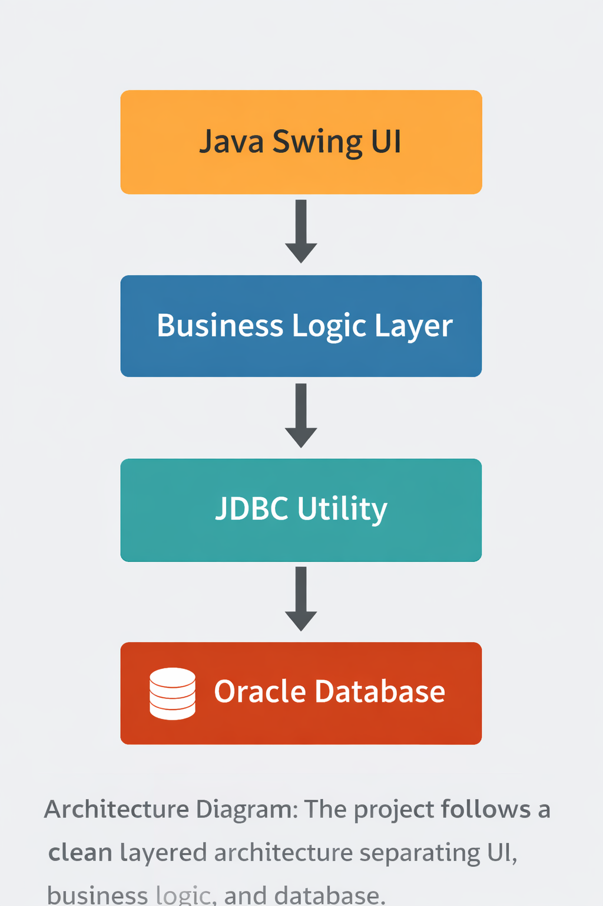
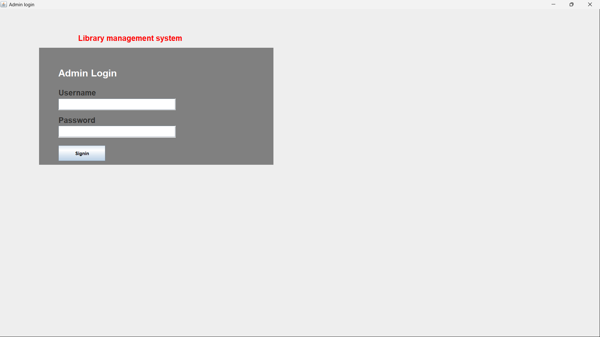
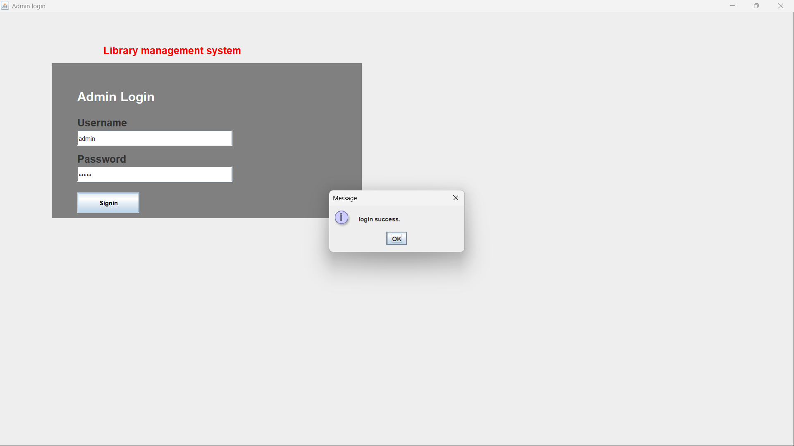
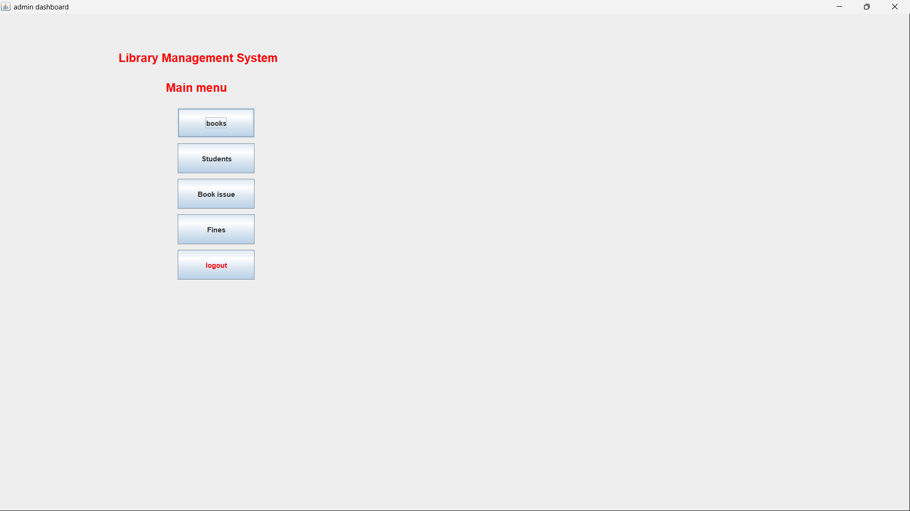
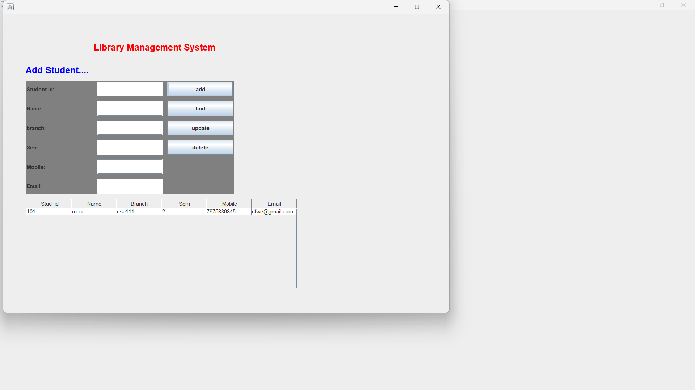
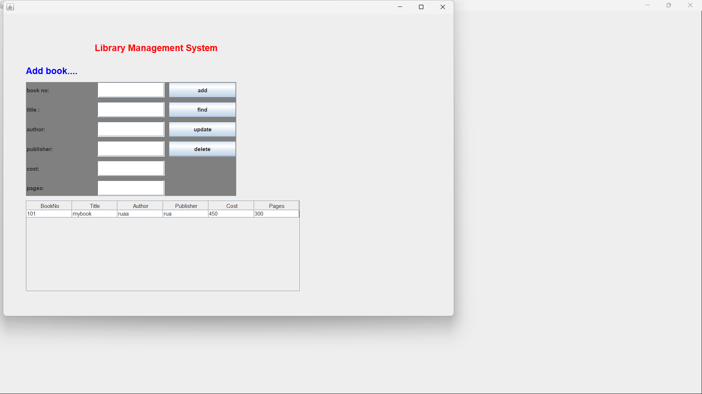

## -------Library Management System (Core Java + Oracle DB)-------

A desktop-based **Library Management System** developed using **Core Java (Swing)** and **Oracle Database**, implementing complete **CRUD operations**, **role-based admin access**, and a **clean layered architecture**.

This project demonstrates strong fundamentals in **Java OOP**, **JDBC**, **SQL**, and **real-world application design**.

---

Key Features:
###  Admin Authentication: 
- Secure admin login using Oracle database validation
- Prevents unauthorized access to system modules
###  Book Management:
- Add new books
- Search books by Book ID
- Update book details
- Delete books
- View all available books in tabular format
###  Student Management:
- Add student records
- Search student by ID
- Update student information
- Delete student records
- View all students list
###  Desktop GUI:
- Built using **Java Swing**
-Separate screens for:
  - Admin Login
  - Admin Dashboard
  - Book Management
  - Student Management
- Real-time table updates after CRUD operations


##  Architecture Overview
The project follows a **clean layered structure**:

src/

├── driver → Application entry point

├── dbase → Business logic & JDBC operations

├── dbutils → Database connection handling

├── entity → POJO / Model classes

├── uidesign → Swing-based UI components

##  Architecture Diagram

The project follows a clean layered architecture separating UI, business logic, and database access.




### Design Principles Used
- Separation of concerns
- Reusable database utility layer
- POJO-based entity modeling
- PreparedStatement for SQL security


##  Technology Stack

| Layer            | Technology |
|------------------|-----------|
| Language         | Java (Core Java) |
| UI               | Java Swing |
| Database         | Oracle Database (XE) |
| Connectivity     | JDBC |
| Build Tool       | Eclipse IDE |
| Version Control  | Git & GitHub |


##  Database Design (Oracle)

### Tables Used
- `admin` – stores admin credentials
- `book` – manages book records
- `student` – manages student records

### Sample Operations
- Insert / Update / Delete / Select
- Parameterized queries using `PreparedStatement`
- Connection handled via reusable DB utility class

⚠️ **Security Note**

Database credentials are externalized using a `config.properties` file
and are intentionally excluded from version control for security reasons.

Please create your own `config.properties` file locally before running the project.


##  How to Run the Project

1. Clone the repository
   ```bash
   git clone https://github.com/Ruaanaazz/library-management-system-java.git

2. Open the project in Eclipse IDE

3. Add Oracle JDBC driver (ojdbc) to the build path

4. Configure database credentials in:
   dbutils/DBConnection.java

5. Run:
   driver/Mainprg.java

# What This Project Demonstrates
  -Strong understanding of Core Java & OOP
  
  -Real-world usage of JDBC with Oracle DB
  
  -Clean modular code structure
  
  -Hands-on experience with desktop applications
  
  -Production-style CRUD workflows

## 📸 Application Screenshots

###  Admin Login


###  Admin Login (Validation)


###  Main Dashboard


###  Student Management


### 📚Book Management


# Future Enhancements
  -Role-based access (Admin / Librarian)
  
  -Book issue & return module
  
  -Fine calculation system
  
  -Logging & exception handling improvements
  
  -Migration to Spring Boot REST backend
  
-----------------------------------------------------
👤 Author
Ruaanaaz
Aspiring Software Engineer | Java | Databases | Backend Systems

This project is built to demonstrate industry-ready Java fundamentals and enterprise-style coding practices.
If you find this project useful, feel free to star the repository!
